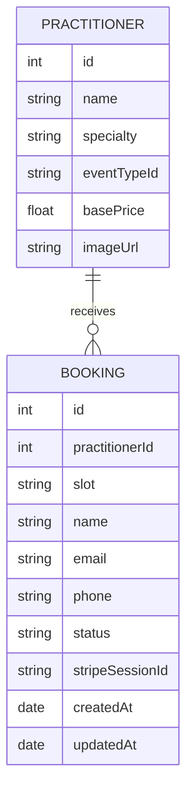
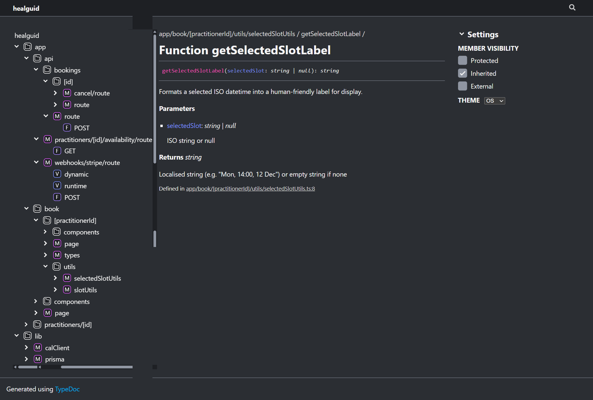

# HealGuid – Booking Flow (Cal.com + Stripe)

Technical demo of the **booking + payment flow** for HealGuid, implemented in **Next.js 16 (App Router)** with **TypeScript**, **Prisma + PostgreSQL**, **Stripe Checkout**, and integration with **Cal.com** for availability.

This project corresponds to **Assignment 1 – Booking Flow (Cal.com + Stripe)** from the official HealGuid assignment document.

The goal is to demonstrate, end-to-end:

* How a patient lands on the app, chooses a **practitioner**, selects a **time slot** and completes payment in **2–3 minutes**.
* How the backend manages the **booking lifecycle** (`pending` → `confirmed` → `cancelled` / `failed`) using **Stripe webhooks** and a clear **domain model** for `Practitioner` and `Booking`.
* How the integration with **Cal.com** provides live availability (when reachable), with a safe fallback when the external API is down.

---

## 1. Overview

### 1.1 What this demo delivers

* A list of **practitioners** loaded from the database, with rich data:

  * Name, title, image
  * Tags / specialties
  * Price, experience
  * Professional associations
  * Languages, consultation type, etc.

* A **booking page** per practitioner with:

  * **Availability** lookup for the next 14 days via Cal.com (or controlled fallback).
  * Patient form (name, email, phone, preferences) with validation using **React Hook Form + Zod**.
  * **Stripe Checkout** button, using each practitioner’s `basePrice` (in GBP).

* Stripe webhook that:

  * Receives `checkout.session.completed` events.
  * Finds the booking via `bookingId` in `metadata`.
  * Updates the `status` to `confirmed` in an **idempotent** way.

* **Status pages**:

  * `/booking/success` with copy aligned to the HealGuid flow, showing booking data and allowing cancellation.
  * Flows for `pending`, `confirmed`, `failed`, and `cancelled` states (surfaced via the booking status).

* Navigation experience aligned with the funnel:

  * Home → practitioners directory → practitioner profile / booking page → Stripe Checkout → success.

---

## 2. Tech stack

### 2.1 Core stack

* **Frontend / Backend**

  * [Next.js 16](https://nextjs.org/) (App Router).
  * **TypeScript**.
  * Internal API routes under `app/api`.

* **Database**

  * **PostgreSQL** (e.g. Neon, Supabase, Railway).
  * **Prisma ORM** for schema, migrations, and type-safe DB access.

* **Payments**

  * **Stripe Checkout** (Test mode).
  * Webhook at `/api/webhooks/stripe`.

* **Scheduling**

  * **Cal.com API v1** via HTTP, encapsulated in `lib/calClient.ts`.

* **UI / Styling**

  * **Tailwind CSS v4** (`@import "tailwindcss";` + design tokens in `app/globals.css`).

* **Forms**

  * **React Hook Form** + **Zod** for typed form validation.

* **Documentation**

  * **TypeDoc** for API/code documentation (output under `./docs`).

### 2.2 Tooling & DX

* **Package manager**: `pnpm` (project sets `packageManager: "pnpm@10.24.0"`).
* **Prisma Studio**: DB browser at `http://localhost:5555`.
* **Stripe CLI**: for local webhook forwarding.
* **concurrently**:

  * Used to run **Next.js dev**, **Stripe CLI listen**, and **Prisma Studio** in a single command: `pnpm dev:full`.

---

## 3. High-level architecture

### 3.1 Project structure (simplified)

```text
healguid/
├── app/
│   ├── api/
│   │   ├── bookings/
│   │   │   ├── [id]/
│   │   │   │   ├── cancel/route.ts      # POST /api/bookings/[id]/cancel
│   │   │   │   └── route.ts             # GET  /api/bookings/[id]
│   │   │   └── route.ts                 # POST /api/bookings
│   │   ├── practitioners/
│   │   │   └── [id]/availability/route.ts   # GET /api/practitioners/[id]/availability
│   │   └── webhooks/
│   │       └── stripe/route.ts          # POST /api/webhooks/stripe
│   ├── book/
│   │   ├── [practitionerId]/
│   │   │   ├── components/
│   │   │   │   ├── AvailabilityPicker.tsx
│   │   │   │   ├── BookingClientSection.tsx
│   │   │   │   ├── BookingFlowClient.tsx
│   │   │   │   ├── BookingForm.tsx
│   │   │   │   ├── LoadingAvailability.tsx
│   │   │   │   └── SlotDayGroup.tsx
│   │   │   ├── types.ts
│   │   │   └── page.tsx                 # Practitioner booking page
│   │   ├── components/
│   │   │   ├── PractitionerCard.tsx
│   │   │   └── PractitionerFiltersClient.tsx
│   │   └── page.tsx                     # Practitioners directory (funnel entry)
│   ├── booking/
│   │   ├── cancel/page.tsx              # Cancel page
│   │   └── success/page.tsx             # Success / status page
│   ├── practitioners/
│   │   └── [id]/
│   │       ├── components/              # Practitioner page building blocks
│   │       ├── types.ts
│   │       └── page.tsx                 # Detailed practitioner profile
│   ├── partners/                        # Marketing for partners
│   │   ├── apply/page.tsx
│   │   └── page.tsx
│   ├── layout.tsx
│   ├── globals.css
│   └── page.tsx                         # Landing page
├── components/
│   └── layout/marketing/                # Shared marketing components
├── lib/
│   ├── prisma.ts                        # PrismaClient singleton
│   └── calClient.ts                     # Cal.com client + slot normalization
├── prisma/
│   ├── schema.prisma
│   ├── migrations/
│   └── seed.ts                          # Seed data (practitioners)
├── public/
│   ├── images/
│   │   ├── logos/
│   │   └── practitioners/
│   └── videos/hero/
├── docs/                                # TypeDoc output (generated)
├── typedoc.json
├── package.json
├── tsconfig.json
└── ...
```

### 3.2 Data models (Prisma)

## Database Entity-Relationship Diagram (ER)



Main part of `prisma/schema.prisma` (summarized):

```prisma
datasource db {
  provider = "postgresql"
  url      = env("DATABASE_URL")
}

model Practitioner {
  id          Int      @id @default(autoincrement())
  name        String
  title       String?
  imageUrl    String

  shortBio    String
  longBio     String

  tags        String   @default("[]")
  country     String
  city        String?
  consultationType String

  languages   String   @default("[]")

  experienceYears Int
  hourlyRate      Int

  satisfactionScore    Float
  successfulSessions   String
  memberSince          DateTime

  professionalAssociations String @default("[]")

  eventTypeId   String      // Cal.com event type ID
  basePrice     Int         // Price in GBP (integer, e.g. 80 → £80)

  bookings      Booking[]
}

model Booking {
  id              Int          @id @default(autoincrement())
  practitionerId  Int
  practitioner    Practitioner @relation(fields: [practitionerId], references: [id])

  slot            DateTime     // Selected time slot
  name            String
  email           String
  phone           String

  status          String       // pending | confirmed | cancelled | failed
  stripeSessionId String?

  createdAt       DateTime @default(now())
  updatedAt       DateTime @updatedAt
}

model StripeWebhookEvent {
  id        String   @id      // Stripe event ID
  type      String
  createdAt DateTime @default(now())
}
```

These models support:

* Mapping between **Cal.com** (`eventTypeId`) and the internal practitioner catalog.
* Tracking the **slot** (date/time of the appointment) directly in the `Booking` row.
* End-to-end status transitions driven by Stripe webhook events.

## 4. Booking + Stripe flow (text diagram)

1. Patient lands on `/book`.

2. Chooses a **practitioner** from the grid.

3. Gets redirected to `/book/[practitionerId]`, where:

   * The server-side page fetches the practitioner from the DB.
   * The client-side section fetches availability via `GET /api/practitioners/[id]/availability`.
   * The list of **slots** (next 14 days, practitioner’s timezone) is rendered.

4. Patient selects a slot and fills **name, email, phone** (and optional preferences).

5. On form submit:

   * Frontend calls `POST /api/bookings` with `{ practitionerId, slot, name, email, phone }`.
   * Backend:

     * Validates practitioner + slot (including revalidation of availability when possible).

     * Creates a `Booking` with `status = "pending"`.

     * Creates a **Stripe Checkout Session** with:

       * `amount = practitioner.basePrice * 100` (GBP).
       * `metadata.bookingId = booking.id`.

     * Persists `stripeSessionId` on the booking.

     * Returns `checkoutUrl`.

6. Frontend redirects the user to **Stripe Checkout**.

7. After successful payment, Stripe calls the webhook `/api/webhooks/stripe`:

   * Signature is validated using `STRIPE_WEBHOOK_SECRET`.
   * `checkout.session.completed` is parsed.
   * The system finds `bookingId` in `session.metadata`.
   * The booking status is updated to `confirmed` in an **idempotent** way (replayed events do nothing).

8. Finally, the user is redirected to `/booking/success?bookingId=...`:

   * The page fetches the booking via the internal GET `/api/bookings/[id]`.
   * Displays the current state (`pending`, `confirmed`, `failed`, `cancelled`) with specific messaging.
   * Offers a **cancel** button that calls `POST /api/bookings/[id]/cancel`.

---

## 5. Availability flow (Cal.com)

* `lib/calClient.ts` centralizes:

  * Calls to Cal.com’s API using `CAL_API_KEY` and `CAL_API_URL`.
  * Calculation of a 14-day window.
  * Slot normalization (`start`, `end`, `duration`, `timezone`, etc.).

* `/api/practitioners/[id]/availability`:

  * Loads the practitioner from the database.
  * Uses `eventTypeId` to query the real Cal.com API.
  * Handles errors:

    * `404` if the practitioner does not exist.
    * `503` with a friendly message if Cal.com fails.
    * `500` for unexpected internal errors.

* Fallback:

  * If the API is down or the URL is invalid, the booking page falls back to **generated example slots** and clearly shows that it’s a fallback mode.

---

## 6. Data seeding

The seed script `prisma/seed.ts` populates the database with a **rich list of practitioners**, including:

* Profiles inspired by real HealGuid practitioners.
* Tags (areas of specialization), languages, years of experience, satisfaction scores, and professional associations.
* Mapping from `eventTypeId` to Cal.com:

  * The main block of practitioners uses dedicated IDs (e.g. `4107320`, `4107334`, `4107353`, …).
  * Other practitioners may share a common `eventTypeId` to simplify configuration.

This demonstrates the idea of a **1–N mapping between event types and practitioners**, leaving room to split by consultation type in future versions.

---

## 7. Environment variables

### 7.1 `.env.example` (suggested)

The project expects a `.env` file at the root. A recommended example:

```bash
###############################################################################
# APP CONFIG
###############################################################################

NEXT_PUBLIC_APP_URL=http://localhost:3000
NODE_ENV=development

###############################################################################
# STRIPE
###############################################################################

STRIPE_SECRET_KEY=insert_your_stripe_secret_key_here

STRIPE_PUBLISHABLE_KEY=insert_your_stripe_publishable_key_here
NEXT_PUBLIC_STRIPE_PUBLISHABLE_KEY=insert_your_stripe_publishable_key_here

STRIPE_WEBHOOK_SECRET=insert_your_stripe_webhook_secret_here

###############################################################################
# CAL.COM
###############################################################################

CAL_API_KEY=insert_your_cal_com_api_key_here
CAL_API_URL=https://api.cal.com/v1

###############################################################################
# DATABASE (PostgreSQL)
###############################################################################

DATABASE_URL=insert_your_full_postgresql_connection_url_here
```

### 7.2 Variable summary

* `NEXT_PUBLIC_APP_URL` – Base URL of the app (used for Stripe redirect URLs).
* `NODE_ENV` – Environment (`development`, `production`, etc.).
* `STRIPE_SECRET_KEY` – Stripe secret API key (**never** commit this).
* `STRIPE_PUBLISHABLE_KEY` / `NEXT_PUBLIC_STRIPE_PUBLISHABLE_KEY` – public key for the frontend.
* `STRIPE_WEBHOOK_SECRET` – Webhook secret for signature validation.
* `CAL_API_KEY` / `CAL_API_URL` – credentials and endpoint for Cal.com.
* `DATABASE_URL` – Postgres connection used by Prisma.

---

## 8. Requirements

* **Node.js**: 20+ (recommended).

* **pnpm**: project uses `pnpm@10.24.0` (install with `npm i -g pnpm` if needed).

* **PostgreSQL**:

  * Neon, Supabase, Railway, or local Postgres instance.

* **Stripe**:

  * Stripe account (Test mode is enough).
  * **Stripe CLI** for local webhook forwarding (`stripe listen`).

* **Cal.com**:

  * API key in live or sandbox mode, with at least one `eventType` configured.

---

## 9. How to run locally

### 9.1 Quickstart (recommended)

```bash
# 1. Clone and enter
git clone https://github.com/<user>/healguid.git
cd healguid

# 2. Install dependencies
pnpm install

# 3. Create and fill .env
cp .env.example .env
# Edit .env and fill Stripe, Cal.com and DATABASE_URL

# 4. Initialize database (schema + seed)
pnpm db:init

# 5. Run full dev environment
pnpm dev:full
```

What `pnpm dev:full` does:

* Starts **Next.js dev server** (`http://localhost:3000`).

* Starts **Stripe CLI** with:

  * `stripe listen --events checkout.session.completed --forward-to http://localhost:3000/api/webhooks/stripe`

* Starts **Prisma Studio** (`http://localhost:5555`) for DB inspection.

> The first time you run `stripe listen` (even manually), it will print something like:
> `Your webhook signing secret is whsec_XXXXXXXXXXXXXXXXXXXXXXXX`
> Copy that value into `STRIPE_WEBHOOK_SECRET` in `.env`. After that, `pnpm dev:full` can be used comfortably.

### 9.2 Manual setup (alternative)

```bash
# 1. Clone and enter
git clone https://github.com/<user>/healguid.git
cd healguid

# 2. Install dependencies
pnpm install

# 3. Configure environment
cp .env.example .env
# Fill in STRIPE_*, CAL_API_KEY, DATABASE_URL, etc.

# 4. Apply schema and migrations
pnpm db:migrate

# 5. Seed data
pnpm db:seed

# 6. Start dev server
pnpm dev
# App at http://localhost:3000
```

Then, in another terminal:

```bash
# 7. Run Stripe CLI for webhooks
stripe login              # if not logged in
stripe listen --events checkout.session.completed \
  --forward-to http://localhost:3000/api/webhooks/stripe
```

And, optionally, in another terminal:

```bash
# 8. Open Prisma Studio
pnpm db:studio
# http://localhost:5555
```

---

## 10. Developer scripts

| Script               | Description                                                                     |
| -------------------- | ------------------------------------------------------------------------------- |
| `pnpm dev`           | Start Next.js dev server.                                                       |
| `pnpm build`         | Build production bundle.                                                        |
| `pnpm start`         | Run production server (after `pnpm build`).                                     |
| `pnpm lint`          | Run ESLint via `next lint`.                                                     |
| `pnpm typecheck`     | Type-check the project (`tsc --noEmit`).                                        |
| `pnpm docs`          | Generate TypeDoc documentation under `./docs`.                                  |
| `pnpm db:push`       | Push Prisma schema to the DB (no migration files, good for quick setup).        |
| `pnpm db:migrate`    | Run Prisma migrations in dev (`prisma migrate dev`).                            |
| `pnpm db:seed`       | Seed the database (`prisma db seed`).                                           |
| `pnpm db:studio`     | Open Prisma Studio on `http://localhost:5555`.                                  |
| `pnpm db:init`       | Shortcut: `pnpm db:push && pnpm db:seed`.                                       |
| `pnpm dev:bootstrap` | Initialize DB (`db:init`) then start dev server (`next dev`).                   |
| `pnpm dev:full`      | Run Next dev + Stripe CLI listen + Prisma Studio together (via `concurrently`). |

---

## 11. How to test the flow end-to-end

### 11.1 Happy path

1. Ensure that:

   * `pnpm dev` **or** `pnpm dev:full` is running.
   * `STRIPE_WEBHOOK_SECRET` is correctly configured in `.env`.
   * The database has been migrated and seeded (`pnpm db:init` or `db:migrate` + `db:seed`).

2. Go to `http://localhost:3000/book`.

3. Choose a practitioner from the list (seeded data).

4. On `/book/[practitionerId]`:

   * Wait for the availability slots to load.
   * Select a slot.
   * Fill in name, email, and phone.

5. Click the checkout button.

6. In Stripe Checkout:

   * Use test card `4242 4242 4242 4242` with any future expiration date and any CVC.

7. After payment:

   * Stripe fires `checkout.session.completed` to the webhook.
   * The backend updates the booking to `confirmed`.
   * You are redirected to `/booking/success?bookingId=...`.

8. On `/booking/success`:

   * Check that:

     * The booking status is **Confirmed**.
     * Practitioner and patient data are correct.
     * The cancel button is visible and, on click, changes the status to **Cancelled**.

---

## 12. Implementation phases (history & decisions)

This summarizes the implementation phases, aligned with `TECHNICAL_DECISIONS_v2.md`.

### Phase 1 – Setup & Architecture

**Goal**
Spin up a functional project skeleton in Next 16 + TypeScript, with Prisma, Stripe and Cal.com configured.

**Key decisions**

* Use **Next.js App Router** with internal API routes (Option A from the assignment).
* Use **Prisma** to model `Practitioner`, `Booking`, and `StripeWebhookEvent`.
* Use **Postgres** via `DATABASE_URL` (instead of SQLite) to mirror a realistic production setup.

### Phase 2 – Domain & Seed

**Goal**
Model the minimal assignment domain: practitioner catalog + booking lifecycle + Stripe event log.

**Decisions**

* `Practitioner` includes `eventTypeId` and `basePrice` to decouple Cal.com + pricing from the UI.

* `Booking` includes:

  * `status` (`pending`, `confirmed`, `failed`, `cancelled`).
  * `stripeSessionId` for debugging and support workflows.
  * `slot` as a `DateTime` representing the chosen appointment.

* Seed with realistic practitioners (20+), including tags, languages, and associations.

### Phase 3 – Availability (Cal.com)

**Goal**
Implement `GET /api/practitioners/[id]/availability` based on Cal.com.

**Decisions**

* Use a 14-day window for slots.

* Return a normalized response with:

  * `practitionerId`
  * `range` (start / end)
  * `timezone`
  * `slots[]` with `start`, `end`, `duration`, etc.

* Handle errors explicitly:

  * `404` for unknown practitioner.
  * `503` when Cal.com fails.
  * Fallback on the booking page when we can’t load live availability.

### Phase 4 – Stripe Checkout + Webhook

**Goal**
Close the loop `booking → checkout → webhook → status`.

**Decisions**

* `POST /api/bookings`:

  * Validates practitioner + slot.
  * Creates a `pending` booking.
  * Creates a Checkout Session with `bookingId` in `metadata`.

* `POST /api/webhooks/stripe`:

  * Validates signature via `STRIPE_WEBHOOK_SECRET`.
  * Processes only `checkout.session.completed`.
  * Updates booking status to `confirmed`.
  * Ensures **idempotency**: repeated events do not corrupt or duplicate state.

### Phase 5 – Booking Flow & UX

**Goal**
Make the booking process straightforward and hard to get lost in.

**Decisions**

* `/book` is the single funnel entry.

* `/book/[practitionerId]` brings together:

  * Availability.
  * Patient form.
  * Stripe CTA.

* Clear UI states:

  * Loading indication while fetching slots.
  * Cal.com error / fallback message.
  * Submit button disabled until a slot is selected when live/fallback mode is active.

### Phase 6 – Profiles & Navigation

**Goal**
Separate **marketing/profile** pages from the **booking flow**, while keeping them connected.

**Decisions**

* `/practitioners` and `/practitioners/[id]` focus on describing the practitioner (story, long bio, stats).
* `/book` and `/book/[practitionerId]` focus on converting the user (availability + payment).
* Practitioner cards use two CTAs:

  * **View profile** (teal secondary).
  * **Request consultation** (orange primary).

### Phase 7 – Deploy & Environment configuration

**Goal**
Deliver a fully running production deployment (e.g. Vercel + Neon + Stripe + Cal.com).

**Decisions**

* Deploy as a single Next.js app (frontend + backend) on Vercel.
* Use **Neon** (or similar) for hosted Postgres.
* Configure Stripe webhook endpoint on `/api/webhooks/stripe` with its own production secret.
* Mirror environment variables across Vercel / Neon / local `.env` as needed.

### Phase 8 – Observability & Resilience

**Goal**
Provide useful logs and predictable behavior when external services fail.

**Decisions**

* Log errors and warnings in critical routes:

  * Availability
  * Bookings
  * Stripe webhooks

* Provide controlled fallback for Cal.com with honest messaging to the user.

* Use consistent error responses:

  * HTTP status code.
  * JSON body with `error` code and human-friendly `message`.

### Phase 9 – Documentation, QA & DX

**Goal**
Bring the project to a “ready for review” level.

**Delivered items**

* This `README.md`.

* `TECHNICAL_DECISIONS_v2.md` with:

  * Architecture summary.
  * Differences vs original plan.
  * Textual diagrams for Stripe & Cal.com flows.
  * Explicit trade-offs.

* Manual QA matrix of critical scenarios.

* TypeDoc generation via `pnpm docs`.

* Developer scripts (`db:init`, `dev:bootstrap`, `dev:full`) to minimize onboarding friction.

---

## 13. Manual QA (main scenarios)

| Scenario                           | Main steps                                                             | Expected result                                                              | Status |
| ---------------------------------- | ---------------------------------------------------------------------- | ---------------------------------------------------------------------------- | ------ |
| Book a session (happy path)        | `/book` → pick practitioner → select slot → fill form → pay via Stripe | Booking goes `pending` → `confirmed` via webhook → success page shows status | OK     |
| Non-existing practitioner          | `/book/99999` or invalid `/api` request                                | API returns `404`, UI shows friendly error                                   | OK     |
| Cal.com unavailable                | Break `CAL_API_URL` or use invalid `CAL_API_KEY`                       | Availability call fails, page shows fallback/error message                   | OK     |
| Stripe payment success → confirmed | Complete full flow with test card                                      | Booking status changes to `confirmed`; repeated events don’t corrupt state   | OK     |
| Webhook without bookingId          | Simulate event without `metadata.bookingId`                            | Event logged, booking not modified                                           | OK     |
| `/booking/success` without id      | Visit `/booking/success` without `bookingId` param                     | Page shows error and link back to `/book`                                    | OK     |
| Cancel after success               | On success page, click cancel                                          | Status changes to `cancelled`; UI reflects new state                         | OK     |

---

## 14. Code documentation (TypeDoc)

The repository includes a TypeDoc configuration (`typedoc.json`) to document:

* Core modules (`lib/prisma`, `lib/calClient`).
* Key API routes (`/api/bookings`, `/api/practitioners/[id]/availability`, `/api/webhooks/stripe`).
* Main React components in the booking flow.

### 14.1 Generate docs

```bash
pnpm docs
```

* Output goes to `./docs` by default.
* Open `docs/index.html` in your browser to explore the documentation.

Example:

```bash
# On macOS / Linux:
open docs/index.html

# On Windows:
start docs/index.html
```

```md
### 14.2 TypeDoc screenshot slot

For reviewers, you can add a screenshot of the generated TypeDoc UI.


```

---

## 15. Current limitations & next steps

**Intentional limitations (within assignment scope)**

* No full patient account system (no login, “My bookings”, rescheduling, etc.).
* Cal.com is used for **availability only**; the booking itself is stored internally.
* No admin dashboard or analytics interface.

**Natural next steps**

* Add authentication (email/password or magic link) and a **“My Bookings”** area.

* Add an **admin panel** to:

  * Review bookings by practitioner.
  * Adjust prices and fallback availability.

* Improve observability:

  * Centralized logs.
  * Basic analytics (bookings per day, funnel conversion, drop-off per step).

* Extend the model:

  * Support multiple price tiers or currencies.
  * Map different `eventTypeId`s for virtual vs in-person consultations.
